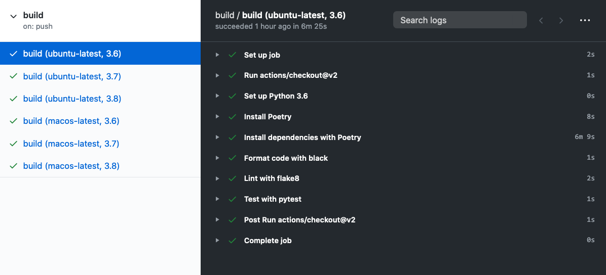

To conclude, we will see how all these steps can be automated with [GitHub Actions](https://github.com/features/actions).

A GitHub action (or "workflow") is a series of tasks that can be automated to run at a certain time, e.g. on each pull request or merge to your GitHub repo. Actions are specified with [YAML](https://yaml.org/) config files. Let's build ours up piece by piece. 

First, create the YAML config file.

```bash
mkdir -p .github/workflows && touch .github/workflows/build.yml
```

We will start by adding a name and defining when our action will run.

```yaml
name: build

on:
  push:
    branches: [ master ]
  pull_request:
    branches: [ master ]
```

This says that our job, named `build`, will run on every push and pull request to the master branch of our repository. Next, we define the "build matrix".

```yaml hl_lines="9 10 11 12 13 14 15 16 17"
name: build

on:
  push:
    branches: [ master ]
  pull_request:
    branches: [ master ]

jobs:
  build:

    runs-on: ${{ matrix.os }}
    strategy:
      matrix:
        os: [windows-latest, ubuntu-latest, macos-latest]
        python-version: [3.6, 3.7, 3.8]
```

This means that our action steps will run independently for each of the latest available versions of the Windows, Ubuntu and macOS operating systems on Python versions 3.6, 3.7, and 3.8. Finally, we add the steps to our workflow.

#### Check out our Repository and Set up python

These built-in actions will checkout out our repository and set up the appropriate Python version.

```yaml hl_lines="18 19 20 21 22 23"
name: build

on:
  push:
    branches: [ master ]
  pull_request:
    branches: [ master ]

jobs:
  build:

    runs-on: ${{ matrix.os }}
    strategy:
      matrix:
        os: [windows-latest, ubuntu-latest, macos-latest]
        python-version: [3.6, 3.7, 3.8]

    steps:
      - uses: actions/checkout@v2
      - name: Set up Python ${{ matrix.python-version }}
        uses: actions/setup-python@v2.1.1
        with:
          python-version: ${{ matrix.python-version }}
```

#### Install our Package with Poetry

Using a third-party action, we will install our package with Poetry.

```yaml hl_lines="24 25 26 27 28"
name: build

on:
  push:
    branches: [ master ]
  pull_request:
    branches: [ master ]

jobs:
  build:

    runs-on: ${{ matrix.os }}
    strategy:
      matrix:
        os: [windows-latest, ubuntu-latest, macos-latest]
        python-version: [3.6, 3.7, 3.8]

    steps:
      - uses: actions/checkout@v2
      - name: Set up Python ${{ matrix.python-version }}
        uses: actions/setup-python@v2.1.1
        with:
          python-version: ${{ matrix.python-version }}
      - name: Install Poetry
        uses: abatilo/actions-poetry@v2.0.0
      - name: Install dependencies with Poetry
        run: |
          poetry install
```

#### Lint and Format our Code

Next, we will lint and format our code with `flake8` and `black`, just like we did locally.

```yaml hl_lines="29 30 31 32 33 34 35 36 37"
name: build

on:
  push:
    branches: [ master ]
  pull_request:
    branches: [ master ]

jobs:
  build:

    runs-on: ${{ matrix.os }}
    strategy:
      matrix:
        os: [windows-latest, ubuntu-latest, macos-latest]
        python-version: [3.6, 3.7, 3.8]

    steps:
      - uses: actions/checkout@v2
      - name: Set up Python ${{ matrix.python-version }}
        uses: actions/setup-python@v2.1.1
        with:
          python-version: ${{ matrix.python-version }}
      - name: Install Poetry
        uses: abatilo/actions-poetry@v2.0.0
      - name: Install dependencies with Poetry
        run: |
          poetry install
      - name: Format code with black
        run: |
          poetry run black .
      - name: Lint with flake8
        run: |
          # stop the build if there are Python syntax errors or undefined names
          poetry run flake8 . --count --select=E9,F63,F7,F82 --show-source --statistics
          # exit-zero treats all errors as warnings.
          poetry run flake8 . --count --exit-zero --max-complexity=10 --statistics
```

#### Test out Code

Finally, we will run our tests using `pytest`.

```yaml hl_lines="38 39 40"
name: build

on:
  push:
    branches: [ master ]
  pull_request:
    branches: [ master ]

jobs:
  build:

    runs-on: ${{ matrix.os }}
    strategy:
      matrix:
        os: [ubuntu-latest, macos-latest]
        python-version: [3.6, 3.7, 3.8]

    steps:
      - uses: actions/checkout@v2
      - name: Set up Python ${{ matrix.python-version }}
        uses: actions/setup-python@v2.1.1
        with:
          python-version: ${{ matrix.python-version }}
      - name: Install Poetry
        uses: abatilo/actions-poetry@v2.0.0
      - name: Install dependencies with Poetry
        run: |
          poetry install
      - name: Format code with black
        run: |
          poetry run black .
      - name: Lint with flake8
        run: |
          # stop the build if there are Python syntax errors or undefined names
          poetry run flake8 . --count --select=E9,F63,F7,F82 --show-source --statistics
          # exit-zero treats all errors as warnings.
          poetry run flake8 . --count --exit-zero --max-complexity=10 --statistics
      - name: Test with pytest
        run: |
          poetry run pytest tests
```

Now, every time we open a pull request or push our code to master, everything we have discussed in this guide will run automatically. If any of the individual steps fail, the build will *fail*. Otherwise, the build will *pass*.



For example, the build status of the repository where this guide lives is: 

Thats the end of the guide! We covered some of the most important best practices in software engineering, and specific tools to automate each of them. Then, we learned how we can automate an entire build using GitHub Actions. Checkout the [GitHub repository where this guide lives](https://github.com/JohnGiorgi/se_best_practices_ml_perspective.git) for all the code we covered in the guide.